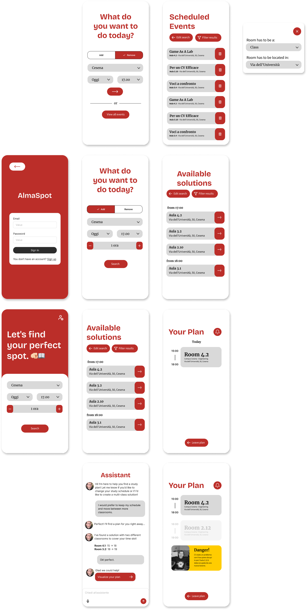

# 2. Design

#### Index

1. [Analysis](1-analysis.md)
2. [Design](2-design.md)
   - 2.1. [Bounded context](#21-bounded-context)
     - 2.1.1. [Core context](#211-core-context)
     - 2.1.2. [Search context](#212-search-context)
     - 2.1.3. [Notification context](#213-notification-context)
     - 2.1.4. [Authentication context](#214-authentication-context)
   - 2.2. [Mockups](#22-mockups)
3. [Architecture](3-architecture.md)
4. [Implementation](4-implementation.md)
5. [DevOps](5-devops.md)
6. [License](6-license.md)

In this section, we define the software design of AlmaSpot, focusing on how the system's components differ and interact
to fulfill the identified functional requirements. Adopting a Domain-Driven Design (DDD) approach, the monolithic
complexity is broken down into four autonomous Bounded Contexts: Core, Search, Notification, and Authentication.
This decomposition allows for clear separation of concerns, where each context manages its own specific domain logic
and data integrity. The following sections explore the tactical design of these contexts, including their aggregates,
entities, and value objects, concluding with a visual representation of the proposed user interface.

## 2.1. Bounded Context

### 2.1.1. Core context

This context is the heart of the system, serving as the definitive source of truth for
the physical availability of university spaces. Its domain model is centered around the
**Room** Aggregate Root, which ensures that no double bookings occur: a room is considered
available only if no **Activity** overlaps with the requested **Period**.

To populate this model, the context implements a **Data Provider** acting as an
_Anti-Corruption Layer (ACL)_.
This component is responsible for scraping, cleaning, and normalizing heterogeneous schedule
data from the external university portal
(`www.unibo.it`) into the system's ubiquitous language.

The context exposes two primary application services:

1. The **ActivityManagementService**, which orchestrates the synchronization of official data
   and allows administrators to manually insert external activities. This service
   relies on the upstream **Authentication Context** to authorize these
   manual operations via token verification.
2. The **RoomSearchService**, which provides an interface for other contexts to query the
   availability of specific rooms.

Finally, whenever the state of a room changes due to a new booking, the context publishes an
**ActivityAddedEvent**, enabling the [Notification Context](#23-notification-context) to react
asynchronously without coupling the logic.

### 2.1.2. Search context

This context acts as the intelligent interface between the user's needs and the system's data.
The logic is encapsulated within the **Search Orchestrator**, a Domain Service that manages the
resolution strategy. Upon receiving a query, the orchestrator first interacts with the
**RoomSearchService** (located in the [Core context](#21-core-context)) to find immediate
availability.

If a direct match is not found, the orchestrator delegates the complexity to the **AIService**.
This service processes a **Request**, which wraps the user's prompt and the relevant
**ContextData** (the list of currently occupied **Slots**). The output is a **Suggestion** value
object,
which aggregates a natural language explanation and a structured **Plan**. This plan is composed of
one or more **Slots**, offering the student a compound itinerary.

Finally, to facilitate integration, this context relies on a _Shared Kernel_ strategy. The
fundamental concept of **Period** is shared globally with the Core and Notification contexts to
ensure temporal consistency. Furthermore,
the **Plan** and **Slot** value objects are shared specifically with
the [Notification context](#23-notification-context).
This decision allows the **Solution** generated here to be directly persisted as a
**Subscription** in the Notification module without requiring complex data mapping or translation.

### 2.1.3. Notification context

This context manages the proactive behavior of the system, adhering to a _Conformist_ relationship
with the [Core context](#21-core-context). Its primary responsibility is to alert students when
a previously available space becomes occupied.

The domain model is centered on the **Subscription** Aggregate Root, which links a **Student** to a
specific **Plan** (a collection of **Slots**) they wish to monitor. The logic is driven by the
**NotificationService**, which acts as an event handler: it consumes the **ActivityAddedEvent**
emitted by the Core whenever a new activity is added.
Upon receiving an event, the service checks for temporal intersections between the new activity
and the active subscriptions.
If a conflict is detected (the student's planned slot is no longer valid), the system generates
a **Notification** entity, which triggers the delivery of an alert to the user.

### 2.1.4. Authentication context

This context is responsible for identity and access management, specifically targeting the
**Administrator** role. It isolates the security logic from the business domains.

The central component is the **AuthService**, which acts as the gateway for registration
(`signUp`) and authentication (`login`). To ensure security, the **Administrator** Aggregate
Root encapsulates sensitive data by storing a `hashedPassword` alongside a specific `salt`.

Upon successful authentication, the service generates a **Token**. This token serves as a
portable, stateless proof of identity that is subsequently used by the [Core Context](#21-core-context)
(**ActivityManagementService**) to authorize privileged operations, such as creating or deleting
external activities, via the `verifyToken` method.

## 2.2. Mockups

