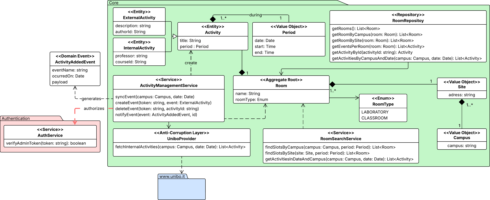
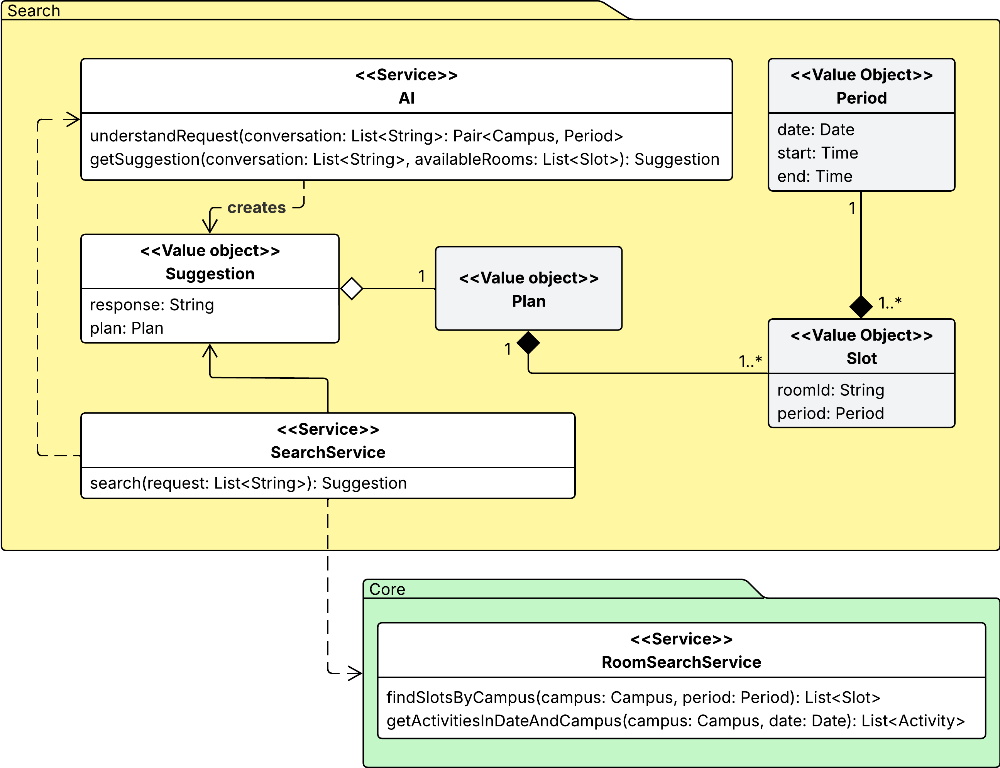
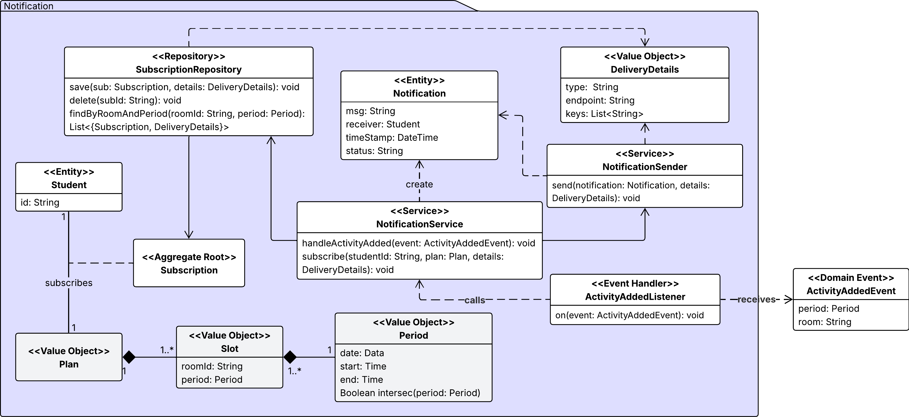
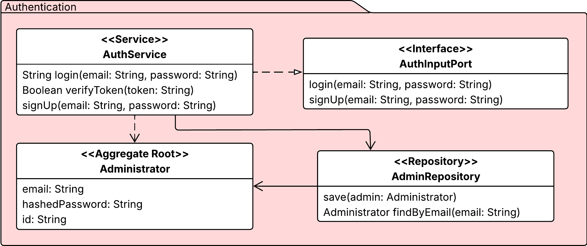
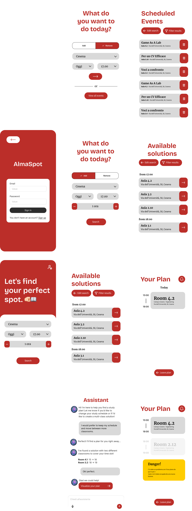
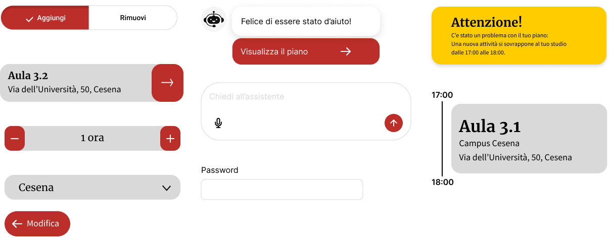
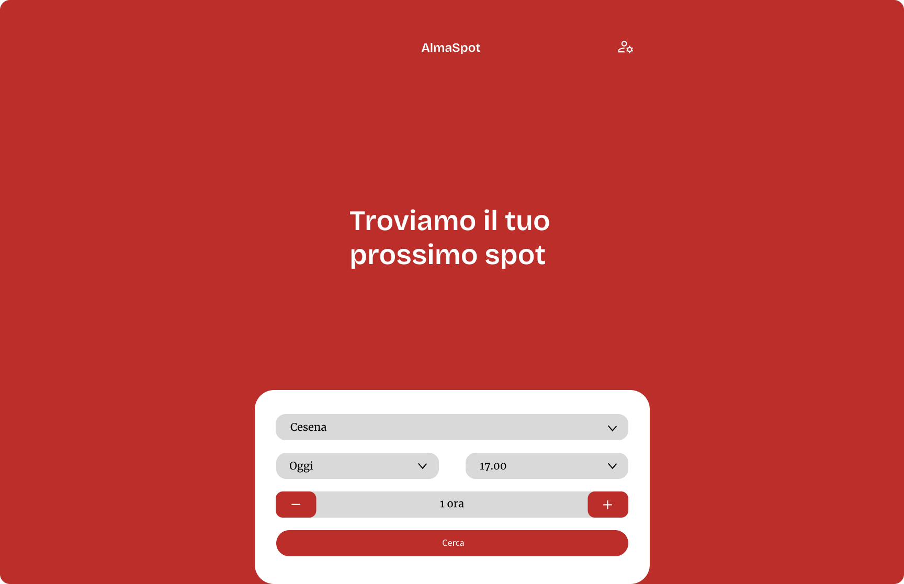

# 2. Design

#### Index

1. [Analysis](1-analysis.md)
2. [Design](2-design.md)
   - 2.1. [Bounded context](#21-bounded-context)
     - 2.1.1. [Core context](#211-core-context)
     - 2.1.2. [Search context](#212-search-context)
     - 2.1.3. [Notification context](#213-notification-context)
     - 2.1.4. [Authentication context](#214-authentication-context)
   - 2.2. [Mockups](#22-mockups)
3. [Architecture](3-architecture.md)
4. [Implementation](4-implementation.md)
5. [DevOps](5-devops.md)
6. [License](6-license.md)
7. [Deployment](7-deployment.md)

In this section, we define the software design of AlmaSpot, focusing on how the system's components differ and interact
to fulfill the identified functional requirements. Adopting a Domain-Driven Design (DDD) approach, the monolithic
complexity is broken down into four autonomous Bounded Contexts: Core, Search, Notification, and Authentication.
This decomposition allows for clear separation of concerns, where each context manages its own specific domain logic
and data integrity. The following sections explore the tactical design of these contexts, including their aggregates,
entities, and value objects, concluding with a visual representation of the proposed user interface.

## 2.1. Bounded Context

### 2.1.1. Core context

This context is the heart of the system, serving as the definitive source of truth for
the physical availability of university spaces. Its domain model is centered around the
**Room** Aggregate Root, which ensures that no double bookings occur: a room is considered
available only if no **Activity** overlaps with the requested **Period**.

To populate this model, the context implements a **Data Provider** acting as an
_Anti-Corruption Layer (ACL)_.
This component is responsible for scraping, cleaning, and normalizing heterogeneous schedule
data from the external university portal
(`www.unibo.it`) into the system's ubiquitous language.

The context exposes two primary application services:

1. The **ActivityManagementService**, which orchestrates the synchronization of official data
   and allows administrators to manually insert external activities. This service
   relies on the upstream **Authentication Context** to authorize these
   manual operations via token verification.
2. The **RoomSearchService**, which provides an interface for other contexts to query the
   availability of specific rooms.

Finally, whenever the state of a room changes due to a new booking, the context publishes an
**ActivityAddedEvent**, enabling the [Notification Context](#213-notification-context) to react
asynchronously without coupling the logic.

### 2.1.2. Search context

The search context focuses on interpreting and fulfilling students' requests for available study spaces.
Its logic is mainly encapsulated within the **Search Service**, which manages the resolution strategy: upon receiving a
query (as a list of messages), the service first interacts with the **AI Service** to understand the user's input and
extract structured parameters, such as the desired time slot and campus location.

Using these parameters, the service queries the **Room Search Service** in the [Core Context](#211-core-context)
to obtain currently available **Slots** that match the user's criteria. The output is a collection of free slots during
the requested period. The search context interacts with external contexts mainly through a **Suggestion** value object,
which contains a natural-language explanation and a structured **Plan** (a collection of one or more slots), offering
the student a compound itinerary.

With this information, the service evaluates whether any slots are available. It queries the **AI Service** again,
providing both the original user prompt and the list of currently available slots. The AI processes this information to
generate a **Suggestion**, offering a possible solution to the student. If the student doesn't like the suggestion, they
can refine their search by sending additional messages.

To facilitate integration, this context relies on a _shared kernel_ strategy. The fundamental concept of
**Period** is shared globally with the core and notification contexts to ensure temporal consistency. Furthermore,
the **Plan** and **Slot** value objects are shared specifically with
the [Notification Context](#213-notification-context).
This decision allows the **Suggestion** generated here to be directly persisted as a
**Subscription** in the Notification module without requiring complex data mapping or translation.

### 2.1.3. Notification context

This context manages the proactive behavior of the system, adhering to a _Conformist_ relationship
with the [Core context](#211-core-context). Its primary responsibility is to alert students when
a previously available space becomes occupied.

The domain model is centered on the **Subscription** Aggregate Root, which links a **Student** to a
specific **Plan** (a collection of **Slots**) they wish to monitor. The logic is driven by the
**NotificationService**, which acts as an event handler: it consumes the **ActivityAddedEvent**
emitted by the Core whenever a new activity is added.
Upon receiving an event, the service checks for temporal intersections between the new activity
and the active subscriptions.
If a conflict is detected (the student's planned slot is no longer valid), the system generates
a **Notification** entity, which triggers the delivery of an alert to the user.

### 2.1.4. Authentication context

This context is responsible for identity and access management, specifically targeting the
**Administrator** role. It isolates security logic, such as password hashing, from domains to enclose verification logic
within the context of authentication.

The **AuthInputPort** exposes the primary use cases of the authentication: registration (signUp) and authentication
(login). The **AuthService** acting as the concrete gateway that executes the business logic. To ensure security, the
**Administrator** encapsulates sensitive data by storing a hashedPassword.

Upon successful authentication, the service generates a **Token**. This token serves as a
portable, stateless proof of identity that is subsequently used by the [Core Context](#211-core-context) to authorize
privileged operations, such as creating or deleting external activities.

## 2.2. Mockups

We have created a series of mockups for the AlmaSpot user interface design that illustrate the key screens and user
interactions. These mockups aim to provide students seeking available study spaces with a clear and intuitive
experience. Our mobile-first design ensures accessibility and ease of use on smartphones and tablets.

The mockups include the following screens, from left to right and top to bottom:

- Admin login: a login page for administrators to access the management dashboard.
- Home page: the main landing page where students can start searching for available rooms.
- Admin dashboard: a control panel where administrators can manage room availability and activities. This is shown in
  two tabs: "Remove" and "Add." The "Remove" tab allows administrators to remove existing activities, and the "Add" tab
  allows them to add new ones.
- Results page: this is a dynamic page that displays search results.
- Assistant page: this is a chat-based interface where students can interact with the AI assistant to refine their
  search, receive suggestions, and, if no direct matches are found, receive alternative plans.
- Admin results pages: two pages showing the results of administrative actions: one page displays the list of currently
  active activities, and the other page is used to choose rooms when adding a new activity.
- Active plan page: two examples are provided, showing a simple plan with one slot and a compound plan with multiple
  slots. Details such as an alert in case of a conflict are included.
- Filter panel: this is a pop-up panel that allows students and administrators to apply filters to their search, such as
  room site and room type.

These mockups show a consistent design language that emphasizes usability and clarity. When designing the interfaces, we
first defined a set of reusable components, such as buttons, input fields, and cards for displaying room information.
This approach ensures visual consistency and streamlines the development process by ensuring that common elements behave
uniformly throughout the application.

The resulting collection of UI components extracted from the mockups is shown below:

Finally, for the desktop version of the application, we plan to adapt the layout to take advantage of the larger screen
real estate. However, the core components and user flows will remain consistent with the mobile design to ensure a
seamless user experience across all devices.

Below is an example of how the home page could look on a desktop interface:

