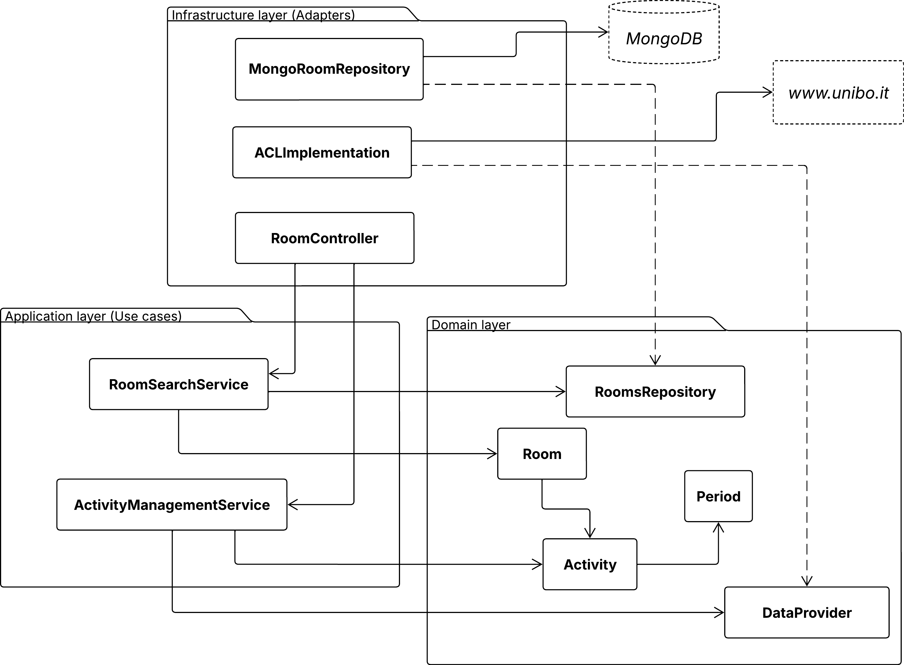

# 3. Architecture

#### Index

1. [Analysis](1-analysis.md)
2. [Design](2-design.md)
3. [Architecture](3-architecture.md)
   - 3.1 [Physical architecture](#31-physical-architecture)
   - 3.2 [Logical architecture](#32-logical-architecture)
4. [Implementation](4-implementation.md)
5. [DevOps](5-devops.md)
6. [License](6-license.md)
7. [Deployment](7-deployment.md)

## 3.1. Physical Architecture

The system is a **Client-Server** application running in a containerized environment.
The system is composed of four main parts:

- **Client (frontend):** a **Single Page Application (SPA)** built with **Vue.js**. It runs in the user's
  browser and works as a **Progressive Web App (PWA)**. It communicates with the server using standard **HTTP APIs**.
- **Server (backend):** built with **Node.js** and **TypeScript**. It handles user requests, manages subscriptions,
  and sends notifications.
- **Data Provider (backend):** a separate background worker built with **Go**. Its only job is to download and process
  university data.
- **Database:** a shared **MongoDB** instance used by both backend services. The Go service writes the classroom
  data here, and the Node.js server reads it to check for availability.

## 3.2. Logical Architecture

Within each specific Bounded Context, we applied **Hexagonal Architecture** principles to protect the Domain Model
from technological coupling. Each module is divided into three concentric layers:

1. **Domain layer (inner layer):** contains _Entities_, _Value Objects_, and business invariants. It is entirely free of
   external dependencies. This is where the interfaces (_Ports_) for external services are defined.
2. **Application layer (middle layer):** contains _Domain Services_ that implement the use cases. It coordinates the
   data flow
   using domain entities without knowing the details of the implementation.
3. **Infrastructure layer (outer layer):** contains the concrete implementations of the interfaces defined in the
   domain. This includes controllers, _Repositories_, and clients for third-party services.

Below is an example architecture diagram for the Core context.

