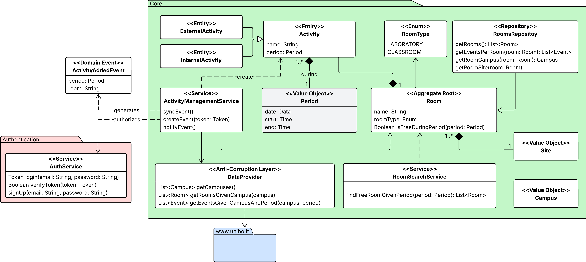
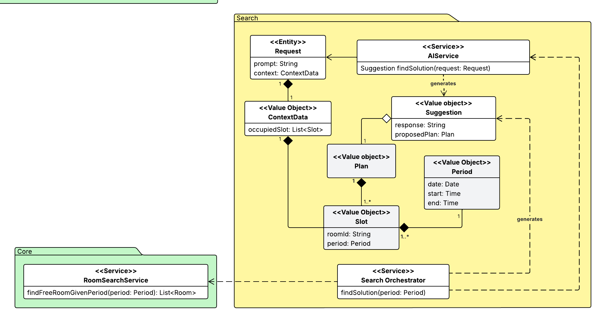
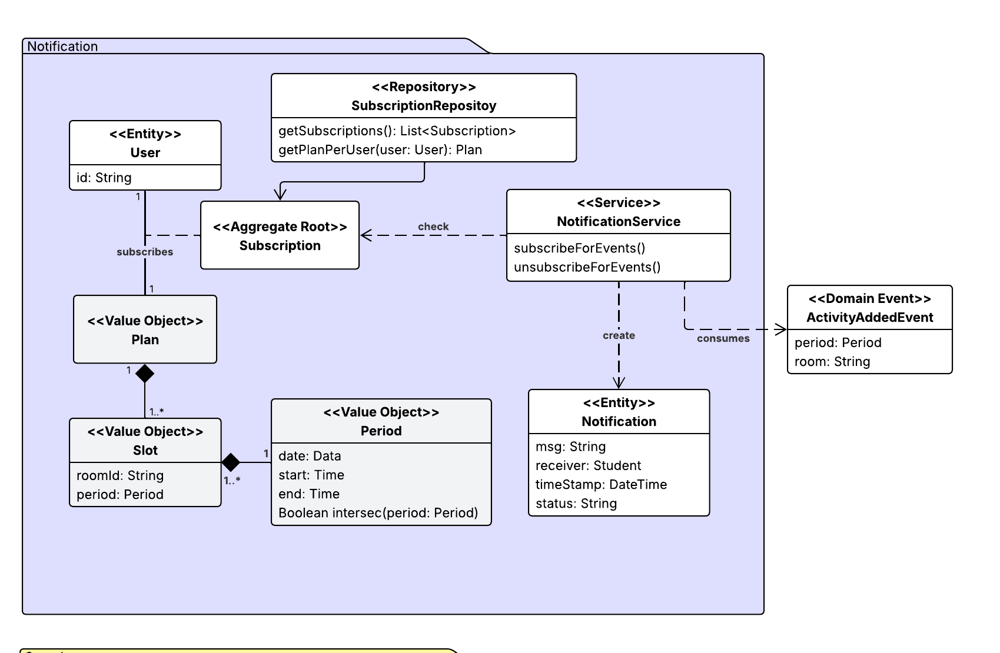
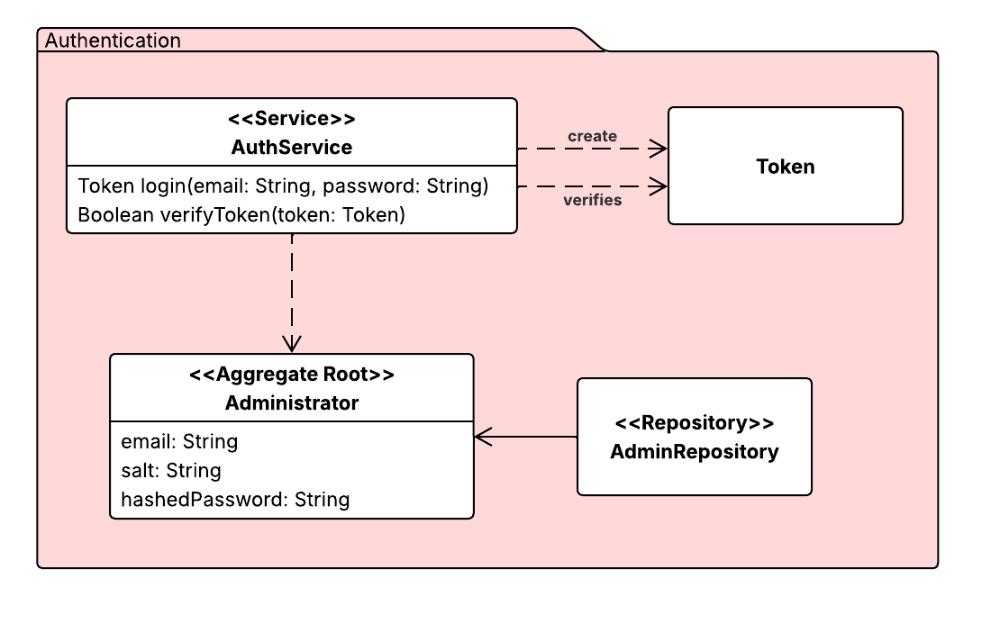

# 1 Analysis and Design

## 1.1 Analysis

This section outlines the analytical process that was carried out in order to understand the 
problem domain, define the system requirements and structure the domain model in accordance with 
the principles of Domain-Driven Design (DDD).

### 1.1.1 Problem Analysis

#### The Context

Students at the University of Bologna often need places to study as the libraries are often full.
They also need spaces where they can work in groups without having to be silent. Currently, 
there is no centralised, real-time method of verifying whether a classroom, laboratory or 
lecture hall is free and available for individual or group study during these periods.

#### The Problem Statement

The current ecosystem raises several critical issues:

1.  **Data fragmentation**: schedule information is scattered across course and/or teacher web 
    portals, making it difficult to gather information about room occupancy.
2.  **Lack of real-time updates**: official schedules do not account for last-minute or 
    unofficial events, such as seminars or S.P.R.I.Te. events.
3.  **Inefficient resource usage**: students who search for a spot at random are often forced to 
    leave a room because they were unaware that a lecture was about to start.

#### Proposed Solution

AlmaSpot is a system that aggregates official data and provides students with an intuitive 
interface to find free rooms and receive proactive push notifications. It also enables 
administrators to manage exceptions manually.

#### Roles

The system recognises two distinct roles:

| User        | Role    | Goals                                                                                                                                               |
|:------------|:--------|:----------------------------------------------------------------------------------------------------------------------------------------------------|
| **Student** | Passive | Wants to find an immediate study spot based on location and time. Needs to be notified when a room becomes occupied or an unscheduled event occurs. |
| **Admin**   | Active  | Responsible for ensuring the accuracy of availability data. They need to be able to add and manage special events.                                  |

### 1.1.2 Requirements Analysis

#### System requirements //TODO: review

1.  **Schedule acquisition**: the system must autonomously acquire heterogeneous schedule data from 
    university sources (Open Data) and normalise it into a consistent format.
2.  **Availability calculation**: The system must determine the real-time status of a resource by 
    intersecting official lectures and administrative blocks.
3.  **Admin override**: The system must allow authorised operators (admins) to manually override a 
    room's availability, with these manual inputs taking precedence over automatic data.
4.  **Smart Discovery (AI)**: The system must support natural language queries (e.g. 'I'd prefer 
    not to move to a different campus') to help users find solutions if a single room is not 
    available for the entire requested period.
5.  **Proactive notification**: the system must follow a 'push' model to notify users who have 
    subscribed to specific solutions of state changes.

#### Functional requirements

1.  As a user, I want to be able to find an available, unused room.
2.  As a user, I want to be able to choose the location, for example the city and campus, I want.
3.  As a user, I want to be able to choose the type of room (such as a lab or a class) I want.
4.  As a student, I want to be kept informed of any unexpected changes to my plan, such as a 
    room no longer being available.
5.  As a student, I'd like to be reminded when I have to leave a room because a lesson is about 
    to start.
6.  As a student, I want to be able to choose the best solution for my needs.
7.  As an admin, I want to be able to add a new event to an available room.
8.  As an admin, I want to be able to remove an event.

#### Non-Functional Requirements

1. The backend must utilize at least two distinct technology stacks (Go for data ingestion, Node.
   js for API/Web).
2. The application must be containerized via Docker and orchestrated via Docker Compose.
3. The frontend must be a Progressive Web App (PWA) optimized for mobile devices.
4. State changes (e.g., Admin override) must be propagated to connected clients via 
   WebSockets/Push.

### 1.1.3 Domain Model

This section defines the conceptual model of the business domain, establishing the ubiquitous 
language shared between developers and domain experts.

#### Ubiquitous Language //TODO: fix

| Term             | Definition                                                                                                                                                                                                                        | Context                    | 
|:-----------------|:----------------------------------------------------------------------------------------------------------------------------------------------------------------------------------------------------------------------------------|:---------------------------|
| **Assistant**    | The conversational component of the system that interprets natural language queries to discover (compound) *Solutions* when a direct search fails.                                                                                | Search                     |
| **Request**      | A natural language input provided by the *Student* describing their study needs.                                                                                                                                                  | Search                     |
| **Suggestion**   | The answer generated by the *Assistant*, containing a proposed *Solution* when possible, otherwise requests a refinement of the search parameters.                                                                                | Search                     |
| **Solution**     | The result provided to the *Student* in response to a request. It can be a simple solution (a single *Slot*) or, if unavailable, a compound solution generated by a *Assistant* (multiple *Slots*).                               | Search                     |
| **User**         | A person that uses the system.   1. **Student**.   2. **Admin**.                                                                                                                                                          | Core, Authentication       |
| **Room**         | A physical spatial unit identified by a name and a *Site*. Can be:   1. **Laboratory**.   2. **Class**.                                                                                                                   | Core, Search, Notification |
| **Period**       | A specific start-time and end-time interval.                                                                                                                                                                                      | Core, Search, Notification |
| **Activity**     | It occupies a *Period* in a specific *Room*. Can be:   1. **Lecture**:  a planned academic activity imported from the official schedule.   2. **Seminar** (or Exception): a non-academic activity.                    | Core, Notification         |
| **Slot**         | A *Period* available for use in a *Room*.                                                                                                                                                                                         | Search, Notification       |
| **Plan**         | A user-defined selection of one or more *Slot*s.                                                                                                                                                                                  | Search, Notification       |
| **Notification** | A proactive alert sent to a *Student* with an active interest in a *Room*. It is triggered by the imminent expiration of an *Slot* (warning to vacate) or by an unexpected *Event* that invalidates the student's current *Plan*. | Notification               |
| **Alert**        | The message delivered via push (e.g., "Room A1 is closing in 10 mins") generated from a *Notification*.                                                                                                                           | Notification               |
| **Subscription** | The link between a *Student* and a specific *Plan* that authorizes the delivery of *Notifications*.                                                                                                                               | Notification               |
| **Campus**       | A macro geographical area of the university (e.g., Cesena, Bologna). It is made up of multiple *Site*. May also be called *City* or *Location*.                                                                                   | Core                       |
| **Site**         | A specific building within a *Campus*, like "Engineering" or "Psychology", composed by *Room*s.                                                                                                                                   | Core                       |
| **Schedule**     | The aggregate collection of all *Academic Events* imported and normalized from university sources. It represents the official timeline before any *Exception* is applied.                                                         | Core                       |

#### Bounded Context //TODO: fix

The domain is partitioned into specific contexts:

1. **Data Acquisition**: Responsible for interacting with external university Open Data context
   (Unibo Go) by means of an AntiCorruption Layer (ACL) pattern. It autonomously scrapes, cleans, 
   and normalizes schedule data into a consistent internal format, which can be used 
   (customer-service pattern) by the Core context.
2. **Smart Discovery**: An auxiliary context that acts as an interpreter. Uses the AI context 
   (ACL), it processes natural language queries and helps define compound solutions by aggregating 
   data from the Availability Context when simple slots are unavailable.
3. **Notification**: Responsible for the proactive "push" logic. It monitors changes in the 
   Availability Context and delivers alerts to users who have active subscriptions (Plans). It 
   follows the DDD Conformist pattern in relationship with the main context.
4. **Availability Management (Core)**: The main context in which lectures, event and available 
   slots are modeled. It models the core features of managing free slots.

## 1.2 Design

