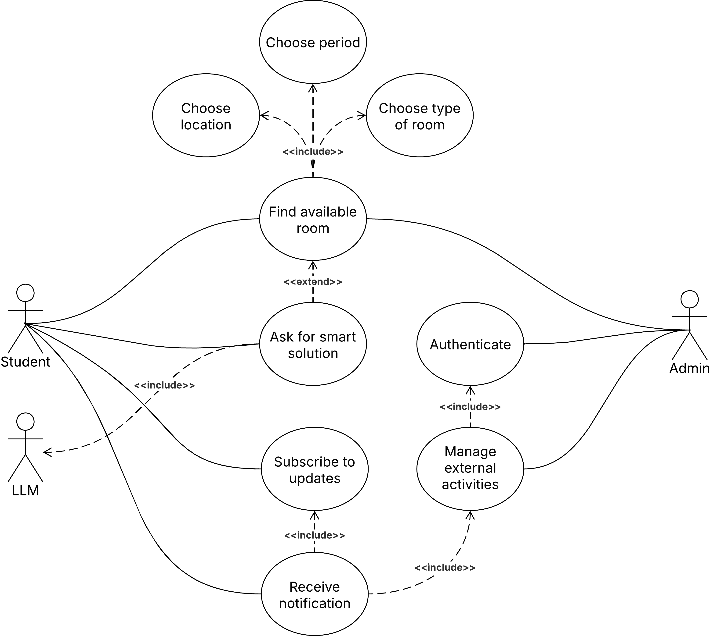
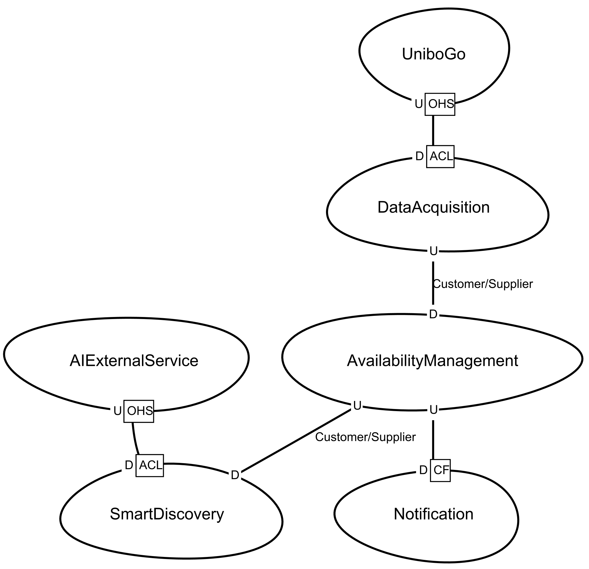

# 1. Analysis

#### Index

1. [Analysis](analysis.md)
    * 1.1. [Problem analysis](#11-problem-analysis)
        * 1.1.1. [Context](#111-the-context)
        * 1.1.2. [Problem statement](#112-the-problem-statement)
        * 1.1.3. [Proposed solution](#113-proposed-solution)
        * 1.1.4. [Roles](#114-roles)
    * 1.2. [Requirements analysis](#12-requirements-analysis)
        * 1.2.1. [System requirements](#121-system-requirements)
        * 1.2.2. [Functional requirements](#122-functional-requirements)
        * 1.2.3. [Non-functional requirements](#123-non-functional-requirements)
    * 1.3. [Domain model](#13-domain-model)
        * 1.3.1. [Ubiquitous language](#131-ubiquitous-language)
        * 1.3.2. [Bounded context](#132-bounded-context)
2. [Design](design.md)
3. [Architecture](architecture.md)
4. [Implementation](implementation.md)
5. [DevOps](devops.md)
6. [License](license.md)

This section outlines the analytical process that was carried out in order to understand the
problem domain, define the system requirements and structure the domain model in accordance with
the principles of Domain-Driven Design (DDD).

## 1.1. Problem analysis

### 1.1.1. Context

Students at the University of Bologna often need places to study as the libraries are often full.
They also need spaces where they can work in groups without having to be silent. Currently,
there is no centralised, real-time method of verifying whether a classroom, laboratory or
lecture hall is free and available for individual or group study during these periods.

### 1.1.2. Problem statement

The current ecosystem raises several critical issues:

1. **Data fragmentation**: schedule information is scattered across course and/or teacher web
   portals, making it difficult to gather information about room occupancy.
2. **Lack of real-time updates**: official schedules do not account for last-minute or
   unofficial activities, such as seminars or _S.P.R.I.Te_. events.
3. **Inefficient resource usage**: students who search for a spot at random are often forced to
   leave a room because they were unaware that a lecture was about to start.

### 1.1.3. Proposed solution

**AlmaSpot** is a system that aggregates official data and provides students with an intuitive
interface to find free rooms and receive proactive push notifications. It also enables
administrators to manage external activity manually.

### 1.1.4. Roles

The system recognises two distinct roles:

| User        | Role    | Goals                                                                                                                                                        |
|:------------|:--------|:-------------------------------------------------------------------------------------------------------------------------------------------------------------|
| **Student** | Passive | Wants to find an immediate study spot based on location and time.   Needs to be notified when a room becomes occupied or an unscheduled activity occurs. |
| **Admin**   | Active  | Responsible for ensuring the accuracy of availability data. They need to be able to add and manage external activities.                                      |

## 1.2. Requirements analysis

### 1.2.1. System requirements

1. **Schedule acquisition**: the system must autonomously acquire heterogeneous schedule data from
   university sources (open data) and normalise it into a consistent format.
2. **Availability calculation**: The system must determine the real-time status of a resource by
   intersecting official lectures and administrator activities.
3. **Smart Discovery (AI)**: The system must support natural language queries (e.g. "I'd prefer
   not to move to a different campus") to help users find solutions if a single room is not
   available for the entire requested period.
4. **Proactive notification**: the system must follow a 'push' model to notify users who have
   subscribed to specific solutions of state changes.

### 1.2.2. Functional requirements

1. As a user, I want to be able to find an available room for a specific period of time.
2. As a user, I want to be able to choose the location, for example the city and site.
3. As a user, I want to be able to choose the type of room (such as a lab or a class).
4. As a student, I want to be informed of any unexpected changes regarding the rooms I am
   interested in, such as a room no longer being available.
5. As a student, I'd like to be reminded when I have to leave a room because a lesson is about
   to start.
6. As a student, I want to be able to choose the best solution for my needs.
7. As an admin, I want to be able to add a new activity to an available room.
8. As an admin, I want to be able to remove an activity.

### 1.2.3. Non-functional requirements

1. The backend must utilize at least two distinct technology stacks (Go for data ingestion, Node.
   js for API/Web).
2. The application must be containerized via Docker and orchestrated via Docker Compose.
3. The frontend must be a Progressive Web App (PWA) optimized for mobile devices.
4. State changes (e.g., Admin override) must be propagated to connected clients via
   WebSockets/Push.

## 1.3. Domain model

This section defines the conceptual model of the business domain, establishing the ubiquitous
language shared between developers and domain experts.

### 1.3.1. Ubiquitous language

| Term             | Definition                                                                                                                                                                                                                                                                              | Context                    | 
|:-----------------|:----------------------------------------------------------------------------------------------------------------------------------------------------------------------------------------------------------------------------------------------------------------------------------------|:---------------------------|
| **Assistant**    | The conversational component of the system that interprets natural language queries to discover (compound) *Solutions* when a direct search fails.                                                                                                                                      | Search                     |
| **Request**      | A natural language input provided by the *Student* describing their study needs.                                                                                                                                                                                                        | Search                     |
| **Suggestion**   | The answer generated by the *Assistant*, containing a proposed *Solution* when possible, otherwise requests a refinement of the search parameters.                                                                                                                                      | Search                     |
| **Solution**     | The result provided to the *Student* in response to a request. It can be a simple solution (a single *Slot*) or, if unavailable, a compound solution generated by a *Assistant* (multiple *Slots*).                                                                                     | Search                     |
| **ContextData**  | Set of activities.                                                                                                                                                                                                                                                                      | Search                     |
| **User**         | A person that uses the system.   1. **Student**.   2. **Administrator**.                                                                                                                                                                                                        | Core, Authentication       |
| **Room**         | A physical spatial unit identified by a name and a *Site*. Can be:   1. **Laboratory**.   2. **Class**.                                                                                                                                                                         | Core, Search, Notification |
| **Period**       | A specific start-time and end-time interval.                                                                                                                                                                                                                                            | Core, Search, Notification |
| **Activity**     | It occupies a *Period* in a specific *Room*. Can be:   1. **Internal Activity**: a planned academic activity imported from the official schedule, such as lectures and exams.   2. **External Activity** (or *Unofficial Activity*): a non-academic activity, such as seminars. | Core, Notification         |
| **Slot**         | A *Period* available for use in a *Room*.                                                                                                                                                                                                                                               | Search, Notification       |
| **Plan**         | A user-defined selection of one or more *Slot*s.                                                                                                                                                                                                                                        | Search, Notification       |
| **Notification** | A proactive alert sent to a *Student* with an active interest in a *Room*. It is triggered by the imminent expiration of an *Slot* (warning to vacate) or by an unexpected *Activity* that invalidates the student's current *Plan*.                                                    | Notification               |
| **Alert**        | The message delivered via push (e.g., "Room A1 is closing in 10 mins") generated from a *Notification*.                                                                                                                                                                                 | Notification               |
| **Subscription** | The link between a *Student* and a specific *Plan* that authorizes the delivery of *Notifications*.                                                                                                                                                                                     | Notification               |
| **Campus**       | A macro geographical area of the university (e.g., Cesena, Bologna). It is made up of multiple *Site*. May also be called *City* or *Location*.                                                                                                                                         | Core                       |
| **Site**         | A specific building within a *Campus*, like "Engineering" or "Psychology", composed by *Room*s.                                                                                                                                                                                         | Core                       |
| **Schedule**     | The aggregate collection of all *Internal Activities* imported and normalized from university sources. It represents the official timeline before any *Exception* is applied.                                                                                                           | Core                       |

### 1.3.2. Bounded context

The domain is divided into specific contexts.

1. **Core**: Responsible for interacting with the open-data context of the university (www.unibo.it) via an
   AntiCorruption Layer (ACL) to obtain information about scheduled lectures. It also manages external activities
   (e.g. seminars), which can be added by administrators who have logged in. It is also responsible for returning free
   rooms in a given period to the search context.
2. **Search**: It interacts with users to help them find the room they need. Moreover, it acts as an interpreter by
   exploiting Gemini's API to understand natural language queries formulated by the user, searching for complex
   solutions when a single room is unavailable for the required period. It has a customer/supplier relationship with
   the core context, from which it obtains the list of available rooms.
3. **Notification**: Responsible for the "proactive" logic. It monitors changes in activities and communicates these to
   users with active subscriptions that are no longer valid. Since the core context emits an event every time a new
   activity is added, it is a conformist context.
4. **Authentication**: An auxiliary context exploited by the core to manage administrator authentication.

There is a shared kernel among the bounded contexts that contains the definitions of plan, slot and period. This
decision was made because these three concepts are crucial, and any change to their definitions must be reflected in all
contexts that handle them.

